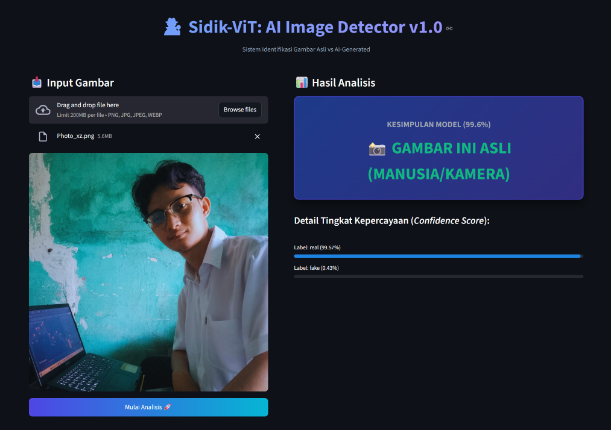

<div align="center">

# 🕵️‍♂️ Sidik-ViT: AI Image Detector v1.0

[](https://huggingface.co/spaces/Ripanrz/Sidik-ViT_AI-Image-Detector-v1.0)


-orange)


</div>

---

**Membedakan batas antara realitas optik dan fabrikasi kecerdasan buatan dalam matriks piksel membutuhkan ketelitian tingkat tinggi.** **Sidik-ViT** dibangun untuk memecahkan tantangan tersebut di era *Generative AI*. 

Mengambil filosofi kata **"Sidik"** (Sunda/Indonesia) yang berarti *memeriksa dengan teliti dan mengenali dengan pasti*, proyek ini mengimplementasikan arsitektur *Computer Vision* tingkat lanjut. Menggunakan fondasi **Vision Transformer (ViT)** dari Google, sistem ini di-*fine-tune* secara spesifik untuk menganalisis anomali tekstur, *noise* mikroskopis, dan pola piksel guna mengklasifikasikan apakah sebuah gambar merupakan hasil tangkapan lensa kamera nyata atau hasil *render* model generatif buatan AI.

---

## 📸 Tampilan Dashboard

> *Antarmuka inferensi berbasis web yang mulus dan interaktif, di-deploy secara live di ekosistem Hugging Face Spaces.*

<div align="center">
  
</div>

---

## 🚀 Fitur Utama

* **Dynamic Balanced Ingestion**: Terintegrasi langsung dengan ekosistem Kaggle API untuk mengunduh dataset skala besar. Dilengkapi dengan algoritma *Full Balanced Stratified Sampling* otomatis yang menjamin distribusi kelas mutlak (50:50) untuk mencegah bias pelatihan.
* **State-of-the-Art Architecture**: Memanfaatkan `google/vit-base-patch16-224-in21k` sebagai *base model*, yang memecah gambar menjadi *patch* 16x16 dan memprosesnya menggunakan mekanisme *Self-Attention* untuk menangkap konteks spasial secara global.
* **Hardware-Optimized Training**: Menggunakan komputasi *Mixed Precision* (`fp16=True`) pada `TrainingArguments` Hugging Face untuk mempercepat waktu komputasi (GPU T4) dan efisiensi VRAM tanpa mengorbankan metrik akurasi.
* **Anti-Flicker Streamlit UI**: Antarmuka web dikunci dengan arsitektur *Session State management* dan injeksi *Custom CSS lock-height*. Hal ini mencegah distorsi *layout* (layar bergetar/kembang-kempis) saat *render* gambar beresolusi tinggi di dalam *iframe* Hugging Face Spaces.
* **Real-time Confidence Breakdown**: Memberikan transparansi keputusan model melalui dekonstruksi *confidence score* (probabilitas matematika) untuk setiap label, dipresentasikan melalui visualisasi *progress bar* yang responsif.

---

## 🔁 Arsitektur Sistem (End-to-End Pipeline)

```mermaid
graph TD
    subgraph Fase 1: Data Engineering & Training
        A[Kaggle API] -->|Download Dataset| B(ImageFolder Loading)
        B -->|Stratified 50:50| C{Data Splitting & Balancing}
        C -->|RGB Convert & Resize 224x224| D[AutoImageProcessor]
        D -->|Fine-Tuning fp16| E((ViT Base Model))
        E -->|Push to Hub| F[(Hugging Face Hub)]
    end

    subgraph Fase 2: Cloud Inference & UI
        G[User Upload Image] -->|Streamlit Frontend| H(Image Rendering)
        H -->|st.session_state| I[Pipeline Inference]
        F -.->|Download Model| I
        I -->|Softmax Probabilities| J{Decision Logic}
        J -->|AI / Real| K[Update Dashboard & Confidence Bar]
    end
